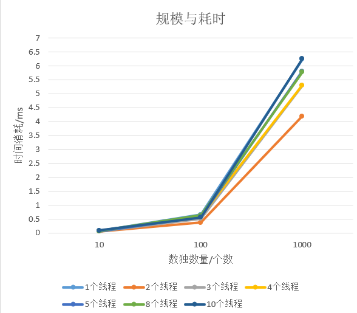
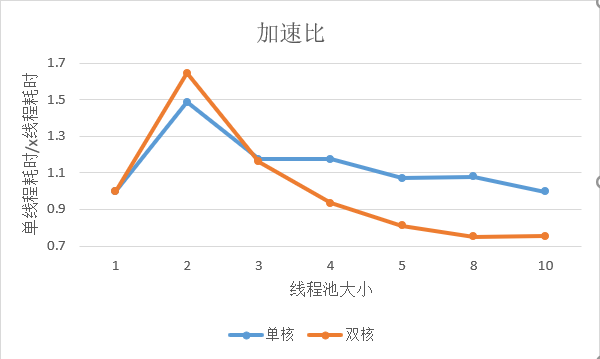
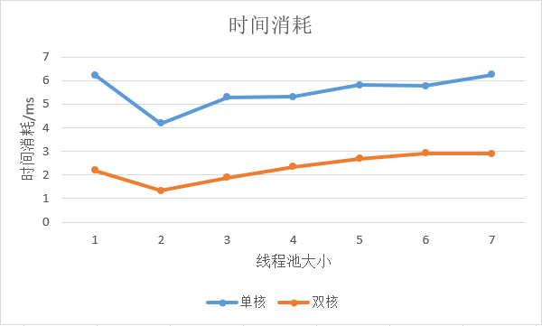

# Lab1 test report

> by 奥利给队

## 一、实验概要

此次实验为学习与探索**多线程编程技术**，以陈果老师所讲的多线程编程的**三个基本策略**为核心，解数独题目为载体，进行多线程编程技术的探索。

### 1.程序编写策略

根据陈果老师上课所讲的多线程编写的三个基本策略，我们最终采取了如下组合进行编程实现：

1. 动态分配任务

    > 每个任务从一个输入队列里取元素执行任务

2. 每个线程做相同任务

    > 统一调用`solve(*Sudoku)`函数进行解题

3. 创建线程池

    > 线程池中部分代码参考老师的[ConcurrentWget-ThreadPool.c](https://github.com/1989chenguo/CloudComputingSlidesAndCodes/blob/master/CodeInSlides/chapter4/ConcurrentWget-ThreadPool.c)。

### 2.输入与输出

```shell
> make
> ./sudoku_slove n
./test1
./test2
Ctrl+D

说明如下：
make后会生成sudoku_slove的二进制文件
运行sudoku_slove的参数n为创建线程池大小
之后是输入程序运行的文件路径名
运行后答案会输出到answer文件里
```

## 二、性能分析

### 1.实验环境

#### 单核：

**VMware：**15.5.1 build-15018445   

**ubuntu：** 16.04 LTS	**Linux内核版本**4.4.0-21-generic  2GB内存

**1个单核CPU：**Intel(R) Core（TM） i5-7300HQ CPU @ 2.50GHz

#### 双核：

**VMware：**15.5.0

**ubuntu：**16.04 LTS     **linux内核版本**为4.4.0-21-generic  2GB内存

**1个双核cpu：**Intel(R) Pentium(R) CPU G4560 @ 3.50GHz

### 2.性能指标

加速比：串行执行时间与并行执行时间的比率，是串行与并行执行时间之间一个具体的比较指标

### 3.性能测试

图一（单核）



图二



图三



#### 1）线程池大小对程序性能分析

有图看出，无论是双核还是单核，线程池大小为2的情况是最快的。双核的情况下比较容易理解，CPU可以最多并发执行2个线程，所以其加速比最大。单核的情况下，线程池大小为2的情况下也得到比较高的性能提升。经过我们的分析，我的认为，在我们的程序结构设计的结构是：主线程往共享输入队列里输入元素；线程池的每个线程并发从共享队列里取元素计算后，放入共享输出队列，**而每当放入一个元素后，共享输出队列会输出当前符合顺序的所有元素**。**这样意味着一个线程进行IO时，另一个线程可以利用CPU进行运算，类似于流水线**，从而提高了效率.

#### 2）单核和双核比较

从加速比可以看出来，同样是双线程，双核的加速比是要快于单核的加速比，这是因为单核只有IO-CPU并行，而无法做到CPU-CPU并行。但是线程超过最佳数量之后，多核的效率下降速度明显快于单核。这是由于线程在双核间切换的开销比单核切换的开销更大的缘故，**双核切换增加了cache的负担，cache未命中率提升（相较单核）造成切换开销增加。**

在线程池大小增大的情况下，可以发现，双核与单核的情况下，加速比都在下降，经分析，线程上下文切换的时间影响了性能。在双核的情况下，随着线程池大小的增加，加速比下降的幅度大于单线程，综合他们所消耗的时间分析，我们认为双核的影响比单核的影响大的原因是，在线程池偏小的时候，单核的性能已经比较低，在增加线程效率也不会更低，而双核可以在一定线程池大小下保持一定效率，也因此受线程池大小影响较大。


### 4.总结分析

## 三、心得体会

### 陈晨

负责文件输入与线程池创建

本次实验我作为组长，想完成高级任务，但是由于3月初到3月中旬，我和组员有不少事情，于是整个实验推到了三月下旬完成，最终由于各种限制，导致只完成初级任务+高级任务第一条（输入任意文件数）。组员们都比较给力，这是以往组队比较难得的。

一开始我的构想是：**循环读写文件，构建一个缓存池还处理大数据读入问题**，但由于时间有限，没有实现，着实有些可惜。我在设计线程池的时候，查找资料发现C++没有自带的线程池，最新也就是C++11的Thread，不得感慨，还是Java香一些。我在网上搜寻了各种线程池实现版本，后来发现，还是用老师的线程池方案比较方便。

总体来看，任务不是很难，但需要有一定的编程功底，尤其是在面对各种问题和BUG的时候，如何判断和处理就显得尤为关键。

### 周大为

负责文件输入与结果测试

这次实验我负责读取文件到队列中，分发队列中的数据，维持和其他同学的进行调用的接口，以及对程序结果。刚开始对文件的读取到队列中不是理解，通过查了一些资料，然后才明白了怎么将文件中的数据压入队列中，每读一行数据就放入队列中成为一个元素。文件数据全部读完了之后，创建多线程从这个队列中把数据取出来放到子队列中，也就是每创建一个线程就会有一个子队列来从大的队列中取元素，当然在这个过程用了信号量和锁，因为这个有点类似于生产者消费者问题，然后是从这些子队列中将元素拿出来，并调用数独解决算法来解决问题。

因为我们自己写了一个Sudoku的数据结构，因此队列中的元素有两个属性，一个标识id和数独问题value，确保了在之后的输出中能够按照顺序输出。刚开始看似没有什么问题，后来一测试发现但线程数量比较多的时候会出现段错误的情况，查了一些时间没找到解决办法，然后就改成list这个数据结构来实现，有参照老师上课演示的例子——关于线程池的，因为list和queue实现方式差不多，所以改起来也比较容易。

关于测试，测试的时候我们输入一个文件的时候，按道理说在stdin输入一个文件就结束了，但那是感觉还能再输入点东西，然而输入的东西不会有结果，然后在找这个原因的时候发现是线程创建之后没有结束，然后就在每个线程里面记录了任务的数量，同时在将数据放进list的时候也记录了元素的个数，这时候就弄了一个等待函数，当任务的数量和输入的元素个数相等时等待一段时间，这样能确保程序正确运行退出了。

这次收获比较多，上这门课是收获最多的，明白了很多东西，很高兴。

### 王林钦

负责数据结构构建与结果顺序输出

构建数据结构的过程是一个复杂的、循序渐进修改的过程，数独这个数据结构穿插在整个过程，可以充当各个过程的一种通讯方式，要尽可能的精简，透明。

对于结果的顺序输出，要根据具体的情况选择合适的数据结构和算法来实现。本实验需要多次插入、删除以及查找。但是查找和插入删除在效率上是矛盾的，所以要根据具体情况进行取舍，数据是小范围乱序，大方向有序，故而放弃堆，选择链表。

### 贺飓兮

负责解数独算法实现与结果测试

本次实验我负责的部分是解数独算法的实现，刚开始我在网上找了找数独有关的算法，有递归实现的，有舞蹈链算法。在看了各种算法的效率之后，我还是选择了舞蹈链算法，这种算法解题效率高。综合网上给的算法和我们自己要实现的要求，最终实现了本次实验所需的数独求解算法。本次实验让我对数独这一类型题目的求解有了掌握，同时也知道了如何多人在线做任务。